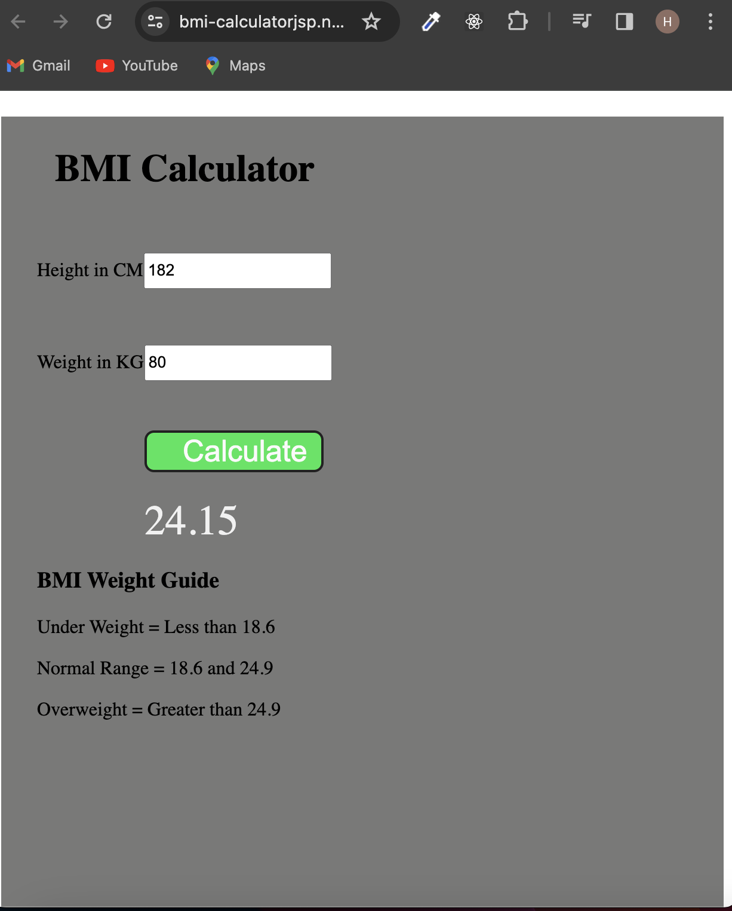

### BMI_Generator

[BMI_Generator](https://bmi-calculatorjsp.netlify.app/)

### Introduction

The BMI (Body Mass Index) Calculator is a web application designed to calculate and display the Body Mass Index of an individual based on their weight and height. This project aims to provide users with a quick and convenient tool to assess their BMI, a commonly used indicator of body fatness.

### Features
- Simple Interface: The application offers a user-friendly interface for entering weight and height information.

- BMI Calculation: The core functionality involves accurately calculating the BMI using the provided weight and height values.

-  Result Display: The calculated BMI is presented along with a corresponding interpretation, such as underweight, normal weight, overweight, or obese.

### Technologies Used
- Frontend: HTML, CSS, JavaScript
- Deployment: Netlify

### Usage
- Open the BMI calculator in a web browser.
- Enter your weight in kilograms and height in centimeters.
- Click the "Calculate BMI" button.
- View the calculated BMI and its interpretation.

### Demo :

### You can Check it Live on Below Link :

[Live Link !](https://bmi-calculatorjsp.netlify.app/)